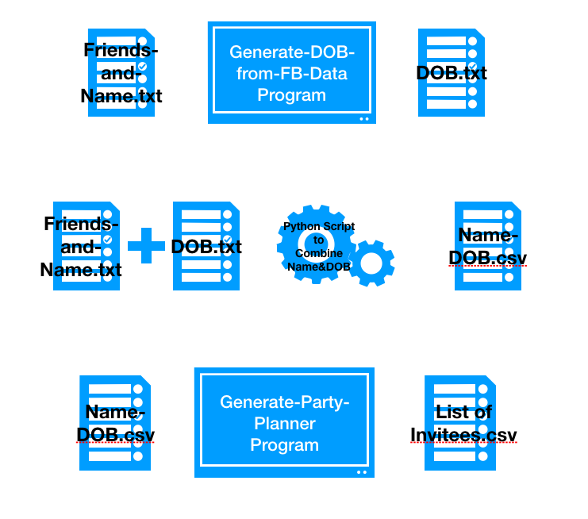

## Regular Expression (Regex)

### Searching for patterns:
In Biology, the majority of our research in genomics involves around finding patterns in a string object. The string object is usually the sequence of DNA or RNA or protein.

Let us consider a case study. Recall that the central dogma of biology is

**DNA → RNA → PROTEIN**.


DNA has protein-coding regions and non-coding regions. In the protein-coding regions of DNA we usually have introns(non-coding) and exons(coding). Transcription generates mRNA from the exons of the DNA whereas all the introns are spliced. Using the mRNA, protein is generated by a process called as translation.

Transcription and translation are highly regulated process. These processes are regulated by special proteins called regulatory proteins. These proteins bind to specific sites in the DNA and control the process of transcription with several other molecules. As a Biologist, we are interested in identifying these "specific sites". These sites are fascinating because modifying these sites (for example let us assume we are removing these sites) affects the transcription and translation of the protein and in turn the entire pathway in which the protein is involved.

Thus, the pattern is this case study is "specific sites" and the string object is DNA.

Some of the other patterns are listed below.  
- Protein Binding Domain
- Restriction Enzyme cut site
- Repeat elements
- Run of Mononucleotides
- ...

There are other instances where looking for pattern becomes useful. When carrying out a project, most often there is a need to use different softwares and programs to aid our research goal. The output/result file from one program serves as an input to the second program. But every program has its own  requirements/ specific format on the input file.

Consider the following scenario:

You have a close friend whose birthday is around the corner. You are planning to throw a surprise party to your close friend. Now, you have an arduous task of compiling the list of common friends and friends of your close friend whom you don't know. Once you have the list and their e-mail ID/phone number you can invite them easily.

You realize that compiling the list of invitees was the hardest task when you organized the party. Luckily, you stumble across a program/software(Invitee Program) that creates a list of invitees given the name of your friend and his/her Date of Birth (DOB). But sadly :cry:, you don't remember the date of birth of all of your close friends. Blimey, you find another program/software(DOB program) that generates the DOB of your close friends from Facebook(FB) Data.

Now, your goal is as follows.  
**GOAL:** whenever you decide to throw a party for your friend, you need the list of invitees.

**HURDLES:**
Now, you are faced with a two hurdles.  

1. DOB program accepts txt file and generates a text file. But Invitee program accepts a csv file and generates a csv file.
2. DOB program's output/ result file gives DOB only in the input order. You have to write a python script to combine the Friends names and their corresponding DOB and write to a csv file.

The following image provides a visual for your project.




The above mentioned scenario is comparable to that of a Biological program.


Here extracting the description from the DNA file and adding it to mRNA file requires pattern searching.

Therefore, searching for pattern is made possible with the help of `re` module in python. `re` stand for **r**egular **e**xpression. We can import this by using the following command.

```python
import re
```
