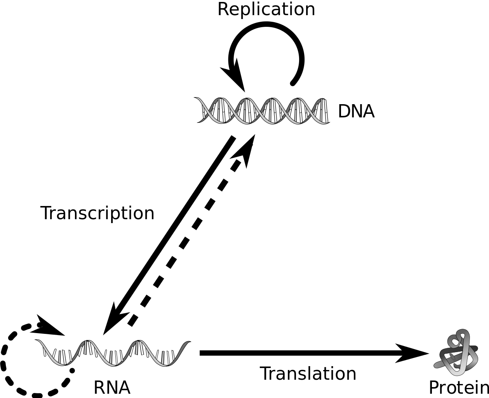
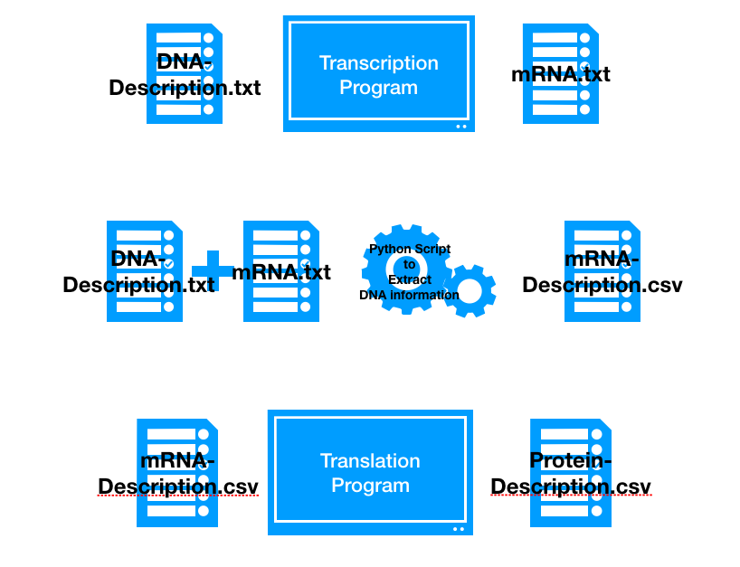

## Regular Expression (Regex)

### Searching for patterns:
In Biology, the majority of research in genomics involves around finding "patterns" in a string object. The string object is usually the sequence of DNA or RNA or protein.

What is a "pattern"?  

To understand about "patterns", let us consider a case study. Recall that the central dogma of biology is

**DNA → RNA → PROTEIN**.



DNA has protein-coding regions and non-coding regions. In the protein-coding regions of DNA we usually have introns(non-coding) and exons(coding). Transcription generates Messenger RNA (mRNA) from the exons whereas all the introns are spliced. Using mRNA as template, ribosomes translate mRNA to protein and hence the name translation.

Transcription and translation are highly regulated process (i.e) when to switch on the production of mRNA/protein,  how much of mRNA/protein to produce and so on. Regulation of these processes are carried by special proteins called regulatory proteins. These proteins bind to specific sites in the DNA and control the process of transcription with several other molecules. As a Biologist, we are interested in identifying these "specific sites". These sites are fascinating because modifying these sites (for example let us assume we are removing these sites) affects the transcription and translation of the protein and in turn the entire pathway in which the protein is involved.

Thus, the pattern is this case study is "specific sites" and the string object is DNA.

Some of the patterns are listed below.

[x] Protein Binding Domain  
[x] Restriction Enzyme cut site  
[x] Repeat elements  
[x] Run of Mononucleotides  
[ ] ...

There are other instances where looking for pattern becomes useful. When carrying out a project, most often there is a need to use different softwares and programs to aid our research goal. The output/result file from one program serves as an input to the second program. But every program may have specific format on the input file which may not match the output from the initial program.

Consider the following scenario:  
DNA and description file is avaiable [here](tribolium.gff).  
You have sequenced a gene and following is the nucleotide sequence.  
```
>XM_015980567.1
ATTTTAGTTGAAATGTGTTTTTGTGCTTGTTTGAGGACTTTTGCGTAGTAATTTCGAACGGAAAATGGTG
CTTTCAGCCAAGCTTCAGAGATGTCTAACATTTACAGGAATCGCATCAATTATTCTTTTAGGAAAAGTAA
AAGGGCAATTTAGTTTATACGAAGAGGAGGTGAGCGCTCCTTGCTCTGATTTCAAAATAGGAAATGATGA
TTTACAAGCGTACGATTTTATTCGATTGTATCGGCTGGACATTGCCGAGACGACACATCCAGGGATTAGC
AAAGTTAGGGGCTCAAATCAGTATCAAACTGCTTATAGATTGGACAAAGACGCGGATTTAACTTTACCAA
CAAGAGATATTTTTCCACAAGGATTACCGGAGCAATTTTCCTTTATTTGCACATTTCGCGCACGCCGTGT
ACCAAAATCTCCGTGGCATTTAATTAGGATCACTGATTTGGAGTCGAGGCCCCAATTTCTCATTTCGTTG
AATCCCAGGAGTGGAACAATCGAGCTTTCATTGAATAATTACGAGGGAGAGCTTCAAACAATCGTTTTTA
ATGGCACAAGTATTTTTGATAAGAACTGGCACAAAATCCACTTTGGGGTATCTAGAGAGAAAGTCATGCT
GTATCTTGACTGCGAAAAAAATGATGAAGCGCTGTTGGTGGAACCTCGAGGGCCTATTGACATTAATGGG
GAATTGTCCGTTTCTAAACTTGAAAATTCAAGACAAACGGTTCCGCGCACATTCCCGATTGATCTTCAGT
GGATGTTCATGACTTGTGATTACACAAAACCATTACGAGAAAGATGCGAAGAACTACCAGAAGTGAGACC
GGTCCAACCGCCCAAAAATCTTGGCCTTCCACCTAAACCGTGTGACGTAACCTGCCCTCAAGGCCCTCCA
GGCTACAACGGCACCGACGGCCGTCCTGGTTTGCCTGGTGAGCCGGGACCACCAGGGCCACCGGGTCGTA
CAGGCCCGCAAGGTGCACGAGGAGAAAGGGGCGAGTTTGGAAGACCAGGATATCCCGGTTCACCAGGTTT
ACAAGGTCTTCCAGGTATAAGGGGAATACAAGGACCCCCCGGGGCTCCAGGACTGCCAGGAAAAGATGGT
GGACGGGGGCCTAAAGGTGATAAGGGTGACAGCGGGGCAAGTGGTCCAAAGGGTGACAGAGGAGAAACTG
GATTTCCGGGATTACCAGGCAGCCAGGGTGTTCCCGGGCCACCAGGTCCTGCTAGTACCATTGATGGAAG
AGTAGTTCAAGGTCCAATAGGACCACAAGGACCCCCAGGATTACCAGGTCCCGAAGGTCCTCCTGGGACT
AAAGGTCTTCGCGGAAACCGTGGTTTACCCGGATTTCCTGGTAAAGACGGTATTCCTGGACAAGATGGTG
CTAAAGGAGAAAAGGGGGAAGCGGGGGAACGTGGAGAAAGAGGATTTACAGGACCAGCGGGACCTCCTGG
TCCACCTGGAATTCAAGTCGGTCAACATACCGCTACCACAGGTGGCCTTCCGGGACCTCGTGGGGAACCT
GGATTTCCGGGAGTGCAAGGAATAAAGGGAAGTAAGGGCGAACAAGGAGAGAGAGGGGAACGTGGAGAAA
AGGGAGAACAAGGTGATCGCGGATTTCCTGGTTTAGACGGAGCTCCAGGTCTTCCAGGGAAAGCAGGATC
AGCAGGTCCGGAAGGACCGAAGGGAGAGACGGGTTTTATCGGACCTCCGGGTGTACAAGGACCTATTGGC
CCATCTGGATTACCAGGACCTCCGGGTGAGCCAGGCGTGCCCGGCTTTCCTGGGTCAAAAGGGGACATGG
GACCTGCAGGTCCCCCTGGATTACCAGGAATTGTATCGTCCTCTGGAGATAAACTAGCACCTGGTCCTCC
TGGCGAACGTGGGCCTCCTGGTTTAGATGGAGAGAAAGGTGAAAGAGGGTTCCCGGGTCTTCCGGGACCA
CCGGGTTTGCCCGGACTTCAAGGACCACCAGGTCCTGAAGGAATCTCCGGAAAAGATGGCGAACAGGGCC
CCCCTGGAATTCGGGGCGAAGCTGGCCCCCAAGGCTCTGAAGGTAAACCCGGCCAACCTGGATACCCTGG
CATTCCAGGCCCCCCCGGAAAACACGGTGATAAAGGCGATCAAGGAGAAACCGGCGAACAAGGTCCTGTT
GGACCCCGCGGATTGCCAGGCCATATGGGTCCCACAGGTCTACCTGGAATTCCGGGTCCTAGTGGTCCAC
AGGGTCTACTAGGTCCGCCAGGACCTGCTGGACCTCCAGGACCTCCGGGCCCACCAGGTGAAAGCGGGGT
TGGTGTCGGGCAACTAATTGTCGACAGTACAGGAGCACCTGGAGTTCATGGTCCCAGAGGATATCCAGGA
CCTGCCGGTCTTCCTGGTGAACGAGGAGCCGCAGGAGAACGGGGTCCAGAGGGAAAACCAGGGATACCTG
GAATTCCAGGAAAGGAAGGACCGCCAGGATTTCCAGGACCTCCGGGGCAAAGAGGCTCGCCGGGGCTGCC
AGGAATGCAAGGATCGCCGGGCAAGAGTTTCACGGAGGCGGAGGTGCGCGATATATGTGCGGCAGTGTTA
CGAGGTGACATAGGACCACCCGGTTTACCCGGAGAAAGGGGCTTCATGGGGCTGCCGGGACCGGCAGGGT
CTCCAGGCTCGATAGGTTTGCCGGGAGAAAGGGGCGAGAAGGGTGACAGAGGGCCCGAAGGAGTTGGAAT
AGAAGGGCCAATGGGGCCTAGGGGGCTGCCAGGTCCTCCGGGACCTCCAGGTGTTGGGTTACAGGGAAGT
ACAGGTGATAGGGGAGAACCGGGAAGACCGGGTCCACCTGGTTTAAGAGGTACACCTGGGCCACAAGGGG
CTCCAGGATACTGCGAATTTTGTAATAATCTCCAAAACTACCAGTACTATGCGGCAATGGCTGCTAGGTC
TGGGGGAAATGATAAAGGGCCGTAATTAGATAATTTAGATAAACCTTATTCCATGTGTTCACTCTGTTAT
CGATTTAGCTTAGCACTGATTATTTTTGTTTAAATGTATTAATATTAAGTTAATGACAAGCGTTCCTATT
CCTGTTGTAAGTAACAAAGATACTTTGCCGAAATATGTTATTAACAACAATCAATAATTGTAGAAACAGA
GGAACGTATCAAAACAATATGTACATACTATGGAATGATAATAAGCTAATAAATAATAATAAAGAAATAT
AAAACAGTA
```

Now you have the following questions.  
**1. What is the protein sequence?**  
**2. What is the name of the protein? **  
**3. Where is it located in the genome of the organism? **  

This is comparable to the following pipeline.



Here extracting the description from the DNA file and adding it to mRNA file requires pattern searching.

Therefore, searching for pattern is made possible with the help of `re` module in python. `re` stand for **r**egular **e**xpression. We can import this by using the following command.

```python
import re
```

### Searching for a pattern in DNA.

#### Simple Search

"GAATTC" is an EcoRI restriction site. To find out whether the nucleotide sequence has this site or not requires "pattern" searching.

```python
import re
dna = "ACTGATCGTAGCTCGTGAATTCACACGAA"
if re.search(r"GAATTC", dna):
  print("Restriction Enzyme Site found!!!")
```
Here search is a function which takes two arguments.

- First, the pattern to search.
- Second, The string containing the pattern.

#### Alternation

Similar to EcoRI, AvaII is a restriction enzyme. However, AvaII recognizes two restriction sites. They are "GGACC" and "GGTCC".
To check if the nucleotide sequence has these sites, we can use the following commands.

```python
import re
dna = "ACTGATCGTAGCTCGTGAATTCACACGAA"
if re.search(r"GGACC", dna) or re.search(r"GGTCC", dna):
  print("Restriction Enzyme Site found!!!")
```

Here the two restriction sites differ by only one nucleotide (A or T in the third site). Therefore, the code can be written in a better way using the pipe ('|') symbol.

```python
import re
dna = "ACTGATCGTAGCTCGTGAATTCACACGAA"
if re.search(r"GG(A|T)CC", dna):
  print("Restriction Enzyme Site found!!!")
```
This A|T (read A or T) is an example for Alternation.

#### Character Groups

BisI is another restriction enzyme which cuts a wide variety of restriction sites. The pattern here is "GCNGC". N stands for any nucleotide (A or T or G or C). So, this pattern can be written in the code as follows.

```python
import re
dna = "ACTGATCGTAGCTCGTGAATTCACACGAA"
if re.search(r"GC(A|T|G|C)GC", dna):
  print("Restriction Enzyme Site found!!!")
```
or all the nucleotides can be grouped together as follows.

```python
import re
dna = "ACTGATCGTAGCTCGTGAATTCACACGAA"
if re.search(r"GC[ATGC]GC", dna):
  print("Restriction Enzyme Site found!!!")
```

**Shortcuts**:  
**.**  - Period symbol can be used to match ***any*** character.  

For Example:  

```python
import re
dna = "ACTGATCGTAGCTCGTGAATTCACACGAA"
if re.search(r"GC.GC", dna):
  print("Restriction Enzyme Site found!!!")
```
Use **.** with caution because, period symbol matches any character. So, "GCAGC" will print `Restriction Enzyme Site found!!!` but so will "GCUGC" or "GC3GC".

**^**  - Caret symbol can be used to ***negate*** character(s).

For Example for AvaII restriction enzyme:  

```python
import re
dna = "ACTGATCGTAGCTCGTGAATTCACACGAA"
if re.search(r"GG[^GC]CC", dna):
  print("Restriction Enzyme Site found!!!")
```

The lines of code above is similar to the following:

```python
import re
dna = "ACTGATCGTAGCTCGTGAATTCACACGAA"
if re.search(r"GG(A|T)CC", dna):
  print("Restriction Enzyme Site found!!!")
```

So using negate symbol, we specify that **if the sequence is not** `GGGCC` or `GGCCC`, then print `Restriction Enzyme Site found!!!`.

#### Quantifiers:

- `?` - Zero or One Character

For Example:  

```python
import re
dna = "ACTGATCGTAGCTCGTGAATTCACACGAA"
if re.search(r"GC?GC", dna):
  print("Restriction Enzyme Site found!!!")
```

Here the regex matches, "GCGC" or "GCCGC" only.

- `+` - One or more times

For Example:  

```python
import re
dna = "ACTGATCGTAGCTCGTGAATTCACACGAA"
if re.search(r"GC+GC", dna):
  print("Restriction Enzyme Site found!!!")
```

Here the regex matches, "GCCGC" or "GCCCGC" or "GCCCCCCCCCCCCCGC" and many others.


- `*` - Zero or more times  

For Example:  

```python
import re
dna = "ACTGATCGTAGCTCGTGAATTCACACGAA"
if re.search(r"GC*GC", dna):
  print("Restriction Enzyme Site found!!!")
```

Here the regex matches, "GCGC" or "GCCGC" or "GCCCGC" or "GCCCCCCCCCCCCCGC" and many others.

- `{}` - for specific number of times. For example, {3} will match the preceding nucleotide for exactly 3 times.

For Example:  

```python
import re
dna = "ACTGATCGTAGCTCGTGAATTCACACGAA"
if re.search(r"GC{3}GC", dna):
  print("Restriction Enzyme Site found!!!")
```

Here the regex matches, "GCCCCGC" only.

- `{x,y}` - for a range of values. For example, {4,7} will match the preceding nucleotide from 4 to 7 times.

For Example:  

```python
import re
dna = "ACTGATCGTAGCTCGTGAATTCACACGAA"
if re.search(r"GC{4,7}GC", dna):
  print("Restriction Enzyme Site found!!!")
```

Here the regex matches, "GCCCCCGC" or "GCCCCCCGC" or "GCCCCCCCGC" or "GCCCCCCCCGC" only.


#### Challenge:  
<iframe src="https://docs.google.com/document/d/e/2PACX-1vTahrmEEg_poABwroQug3JEUf0mNmMUiQbxirvvhBUfLHsgZKdMEoIOtepaYEeGL6cp5xRmS2mwbv6X/pub?embedded=true" width="720" height="720"></iframe>
